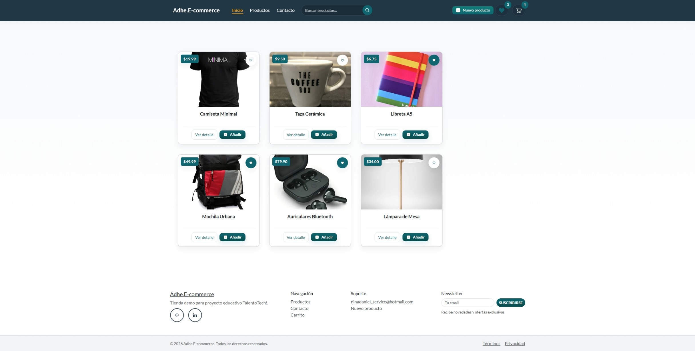
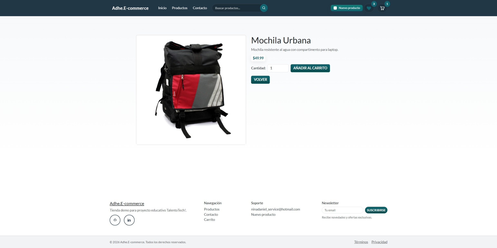
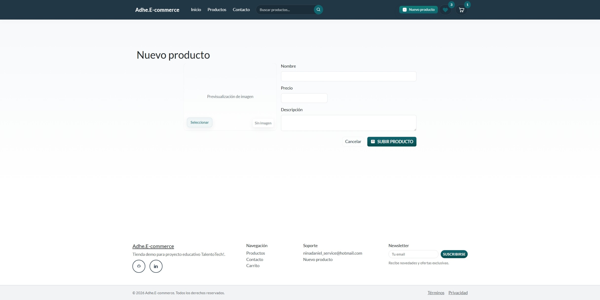
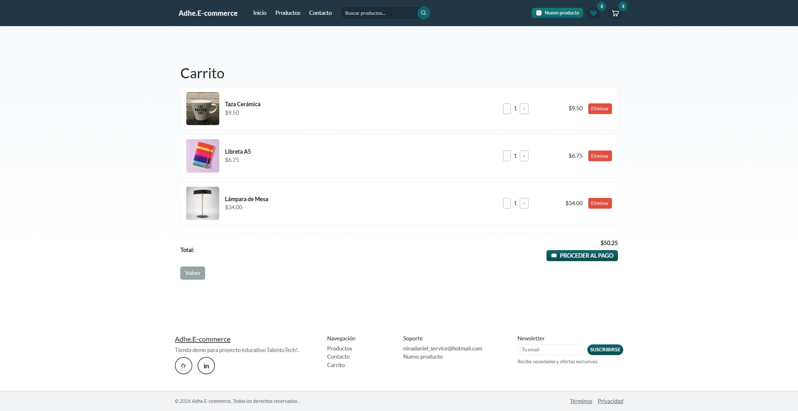
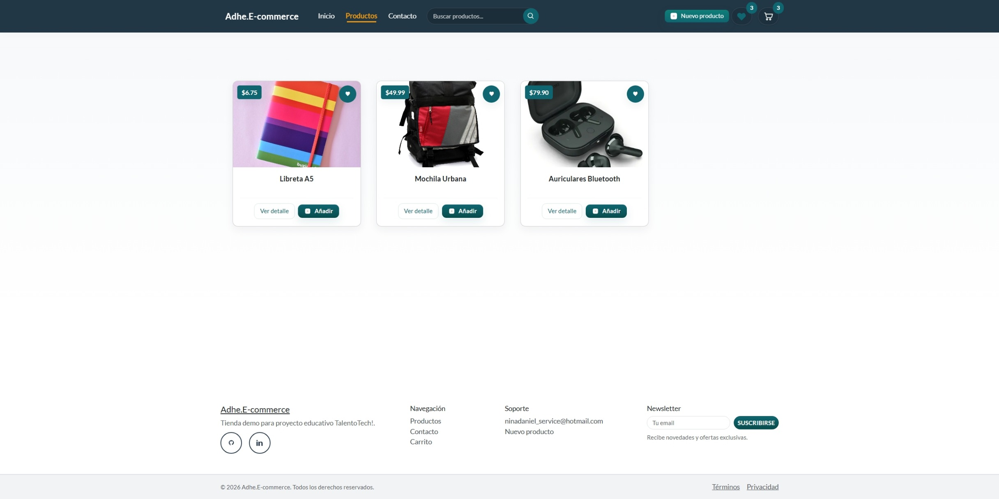

# 🛍️ Adhe.E-commerce — Proyecto PreEntrega

Pequeña tienda demo construida con React + TypeScript (Vite). Este repositorio contiene una aplicación educativa para practicar conceptos de React, hooks, context providers y manejo simple de datos en el frontend. Cuenta con datos de productos precargados, gestión de favoritos en `localStorage`, un carrito de compras simulado y un sistema de notificaciones.

> **Adhe** es parte de User que utilizo para mis proyectos personales (`Adhe-Enne`), puedes encontrar más en [github.com/Adhe-Enne](https://github.com/Adhe-Enne) .

**Resumen rápido**

- **Tipo:** SPA (Vite + React + TypeScript)
- **Stack:** React 19, TypeScript, Vite, Bootstrap 5
- **Propósito:** Practicar manipulación de estado con Contexts, forms, subida de imágenes cliente (FileReader), manejo de favoritos en `localStorage` y notificaciones.

**Arranque rápido**

Requisitos: Node.js (16+ recomendable) y npm.

```bash
# instalar dependencias
npm install

# arrancar modo desarrollo (Vite)
npm run dev

# build de producción
npm run build

# correr eslint
npm run lint

# preview del build
npm run preview
```

**Datos precargados**

- Los productos iniciales están en: `public/productos.json`.
- Imágenes de ejemplo en: `public/images/`
- Favoritos se guardan en `localStorage` con la key `tt_favorites`.
- Los productos creados desde la UI se mantienen en memoria (no se persisten en servidor/localStorage).

**Principales pantallas y acciones (foco funcional)**

**🏠 Home / Productos**

- Lista de productos en cuadrícula. Archivos clave: [src/components/home/HomeContainer.tsx](src/components/home/HomeContainer.tsx)
- Búsqueda por texto: query param `q` (p. ej. `?q=camiseta`).
- Filtrar favoritos: query param `filter=favorites`.
- Acciones por tarjeta: _Ver detalle_, _Añadir al carrito_ (muestra notificación).

**🔎 Detalle de producto**

- Página de detalle por producto (`/producto/:id`). Muestra imagen, descripción, precio y control de cantidad.
- Permite añadir la cantidad seleccionada al carrito. Archivos: [src/components/product/product-detail/ProductDetailContainer.tsx](src/components/product/product-detail/ProductDetailContainer.tsx) y [src/components/product/product-detail/DetalleProducto.tsx](src/components/product/product-detail/DetalleProducto.tsx).

**➕ Nuevo producto**

- Ruta: `/new`. Formulario con campos: nombre, precio, descripción e imagen.
- La imagen se previsualiza antes de subir (FileReader). La subida está simulada (delay) y el nuevo producto se inserta en memoria. Archivos: [src/components/product/product-form/ProductForm.tsx](src/components/product/product-form/ProductForm.tsx) y [src/components/product/product-form/NewProductContainerWrapper.tsx](src/components/product/product-form/NewProductContainerWrapper.tsx).

**🧺 Carrito**

- Lista de ítems añadidos, botones para aumentar/disminuir cantidad, eliminar y ver total.
- El carrito es una estructura en memoria (no persistente) y está gestionado por el `CartProvider`. Archivos: [src/components/cart/Carrito.tsx](src/components/cart/Carrito.tsx) y [src/components/cart/CarritoContainer.tsx](src/components/cart/CarritoContainer.tsx).
- El botón de "Proceder al Pago" simula un proceso de compra mostrando una notificación y luego limpia el carrito y redirige a la página principal.

**💙 Favoritos**

- Cada producto puede marcarse/desmarcarse como favorito desde la tarjeta (♥).
- Favoritos se almacenan en `localStorage` bajo la clave `tt_favorites` (array de ids). El contador en el header usa el valor calculado por el contexto (`count`) para evitar inconsistencias.

**✉️ Contacto**

- Formulario de contacto que muestra una notificación simulada al enviar. Incluye un listado del equipo (Directorio). Archivo: [src/components/contact/Contacto.tsx](src/components/contact/Contacto.tsx).

**🔔 Notificaciones**

- Sistema simple de notificaciones en la parte superior (stack). API expuesta por `useNotification()` para mostrar mensajes con variantes (`success`, `info`, `warning`, `danger`). Ver [src/contexts/Notification/Notification.Provider.tsx](src/contexts/Notification/Notification.Provider.tsx).

**Arquitectura & puntos clave**

- Context Providers: `ProductsProvider`, `CartProvider`, `FavoritesProvider`, `NotificationProvider` — proveen API para la UI (crear producto, añadir al carrito, toggle favoritos, notificaciones).
  - [src/contexts/Products/Products.Provider.tsx](src/contexts/Products/Products.Provider.tsx)
  - [src/contexts/Cart/Cart.Provider.tsx](src/contexts/Cart/Cart.Provider.tsx)
  - [src/contexts/Favorites/Favorites.Provider.tsx](src/contexts/Favorites/Favorites.Provider.tsx)
  - [src/contexts/Notification/Notification.Provider.tsx](src/contexts/Notification/Notification.Provider.tsx)

- Hooks de conveniencia: `useProducts`, `useCart`, `useFavorites`, `useNotification` (ver `src/hooks/`).

- Manejo de imágenes en formularios: `ProductImagePreview` y hooks abortables (`useAbortableFileReader`, `useAbortableTimeout`) que permiten cancelar lecturas y timeouts cuando el componente se desmonta.

**Consejos para probar y depurar**

- Limpiar favoritos en localStorage (para empezar desde cero):
  ```js
  localStorage.removeItem("tt_favorites");
  ```
- Si un producto no aparece en detalle, revisar que el `id` exista en `public/productos.json` o que no se haya eliminado en runtime.
- Notificaciones: revisar `NotificationBar` en la UI para mensajes.

**Rutas principales**

- `/` → Home / listado
- `/productos` → listado (admite `?q=...` y `?filter=favorites`)
- `/producto/:id` → detalle del producto
- `/new` → crear nuevo producto
- `/carrito` → ver carrito
- `/contacto` → contacto + directorio

**Archivos importantes (edición)**

- Layout / header: [src/components/layout/Layout.tsx](src/components/layout/Layout.tsx)
- Formulario producto: [src/components/product/product-form/ProductForm.tsx](src/components/product/product-form/ProductForm.tsx)
- Hooks cancelables: [src/components/product/product-form/hooks](src/components/product/product-form/hooks)
- Datos precargados: [public/productos.json](public/productos.json)

---

Si quieres, puedo:

- Añadir ejemplos de screenshots en el README.
- Generar instrucciones de pruebas (checklist de QA) más detalladas.
- Crear un pequeño script `reports/lines.json` con estadísticas (ya generado si quieres que lo guarde en el repo).

¿Quieres que incorpore capturas o que haga un commit con este README?

**_ Fin del README generado automáticamente por el asistente. _**

## Estructura general de carpetas

A continuación se muestra la estructura general del proyecto. Se omite el contenido de carpetas en niveles inferiores; entre paréntesis se indica brevemente su propósito.

```
/ (raíz del proyecto)
├─ package.json                (dependencias y scripts npm)
├─ vite.config.ts              (configuración de Vite)
├─ tsconfig.json               (configuración TypeScript)
├─ tsconfig.app.json           (configuración TS para la app)
├─ tsconfig.node.json          (configuración TS para node tooling)
├─ eslint.config.js            (configuración ESLint)
├─ index.html                  (HTML base)
├─ public/                     (archivos estáticos servidos por Vite)
│  ├─ productos.json           (datos iniciales de productos)
│  ├─ images/                  (imágenes de productos y assets)
│  └─ screenshots/             (capturas usadas en README / docs)
├─ src/                        (código fuente de la aplicación)
│  ├─ main.tsx                 (entrypoint React + mounting)
│  ├─ index.css, App.tsx       (estilos/global y componente raíz)
│  ├─ assets/                  (recursos estáticos del app)
│  ├─ components/              (componentes UI organizados por dominio)
│  │  ├─ layout/               (header, navbar, layout general)
│  │  ├─ home/                 (pantalla principal y containers)
│  │  ├─ product/              (tarjetas, detalle y formulario de producto)
│  │  ├─ cart/                 (componentes del carrito)
│  │  └─ contact/              (contacto y directorio)
│  ├─ contexts/                (Providers: Products, Cart, Favorites, Notification)
│  ├─ hooks/                   (hooks reutilizables: useCart, useFavorites, etc.)
│  ├─ models/                  (tipos e interfaces TypeScript)
│  └─ utils/                   (helpers y utilidades, p.ej. navigation)
└─ README.md                   (documentación del proyecto)
```

Notas rápidas:

- Los componentes y providers están organizados por dominio para facilitar la navegación y el testing.
- `public/productos.json` contiene los datos de ejemplo que carga la app al inicio.
- Favoritos se gestionan a través de `localStorage` y el `FavoritesProvider` en `src/contexts/Favorites/`.

## 📸 Capturas (placeholders)

A continuación hay capturas de ejemplo que puedes reemplazar por screenshots reales. Si prefieres, súbelas a `public/screenshots/` con los mismos nombres para que se muestren automáticamente.

- Home / listado:

  

- Detalle de producto:

  

- Nuevo producto (form):

  

- Carrito:

  

- Favoritos / lista:

  

> Nota: reemplaza estos archivos por capturas reales (PNG/JPG) manteniendo la ruta `public/screenshots/`.

## 🧰 Tecnologías y extensiones utilizadas

### Tecnologías empleadas

- **React**: ^19.2.5 (react, react-dom)
- **React Router**: ^7.14.0 (`react-router-dom`)
- **UI**: Bootstrap 5 (`bootstrap`) + Bootswatch
- **Build / Bundler**: Vite (^8.0.8)
- **TypeScript**: ^6.0.2
- **Dependencias dev relevantes**: Para lograr un codigo lejible y de calidad, se emplean ESLint (^10.x) y plugins (`@typescript-eslint`, `eslint-plugin-react`, `eslint-plugin-simple-import-sort`, `eslint-plugin-perfectionist`), `@vitejs/plugin-react`.

Archivos clave: `public/productos.json`, imágenes en `public/images/products/`, providers en `src/contexts/` y hooks en `src/hooks/`.

### Extensiones de VS Code Empleadas

- **SonarQube**: Para análisis de calidad del código y detección de problemas estáticos.
- **SonarLint**: Plugin en el IDE para análisis en tiempo real.
- **ESLint** — `dbaeumer.vscode-eslint` (el proyecto incluye configuración de ESLint y plugins para TypeScript y React).
- **Prettier** — `esbenp.prettier-vscode` (formateo automático).
- **GitLens** — `eamodio.gitlens` (útil para historial y revisiones rápidas).
- **Editor: TypeScript/JS built-in** — la funcionalidad de TypeScript viene con VS Code; asegúrate de usar la versión de TypeScript del workspace si la necesitas.

---
